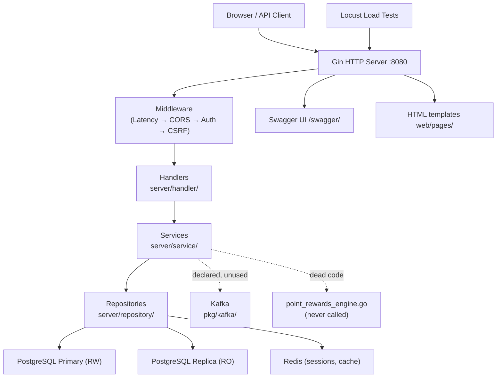

# Codebase Analysis Report

> Generated by: Claude (Opus 4.8) — Tech Lead / Architect Analysis
> Date: 2026-06-23
> Repo / Source: dydanz/go-loyalty-point (`/Users/dandi/Sandbox/go-loyalty-point`)

---

## 1. Executive Summary

go-loyalty-point is a loyalty points management HTTP API — merchants earn and redeem points for their customers across configurable reward programs. The core domain model (users, merchants, programs, transactions, points ledger, redemptions) is well-defined and the architecture shows clear intent toward a clean layered design with repository interfaces. However, the codebase is **not production-ready**. Two critical security vulnerabilities exist: a `.env` file with DB credentials is baked into every Docker image pushed to GHCR, and a public load-test endpoint returns bcrypt password hashes in HTTP responses. The point rewards engine — the central business differentiator — is dead code never invoked from the transaction flow; points are calculated with hardcoded constants instead. System (5xx) errors are silently discarded because `LogError` is an unimplemented stub. The recommended next action is: **stabilize first** — fix the two P0 security issues, the silent-error stub, and the startup session wipe before any further feature work, then wire the rewards engine.

---

## 2. Project Overview

- **Purpose**: Multi-tenant loyalty points platform. Enterprise users (merchants) define loyalty programs with configurable rules; customers earn/redeem points through transactions.
- **Business Domain**: Fintech / Retail — loyalty and rewards
- **Deployment Target**: Monolith on Docker; Kubernetes manifest present (`deployment.yaml`, `service.yaml`)
- **Estimated Codebase Age**: ~6 months. Commit history from late 2024 / early 2025; go 1.23 toolchain.
- **Team Size Indicators**: Single author (Dandi). Consistent style; minor drift — `UserService` uses a latency-decorator pattern not used by any other service.
- **Documentation Status**: Partial — Swagger annotations present; thin `README.md`; no runbook; no ADRs. `CLAUDE.md` + `.claude/` SDLC tooling added recently.

---

## 3. System Architecture

### 3.1 Architecture Pattern

- [x] Monolith
- [x] Layered / N-Tier
- [~] Hexagonal / Ports & Adapters — partial. Repository interfaces in `server/domain/interfaces.go`, but the auth middleware and router depend on the concrete `*postgres.AuthRepository`, bypassing the boundary.

Handler → Service → Repository, with domain types and interfaces defined centrally. Dependency injection is manual, wired in `server/bootstrap/`.

### 3.2 High-Level Component Diagram



### 3.3 Data Flow

**Primary sync request path:**
```
Client → Gin → AuthMiddleware (Redis session lookup → DB fallback)
       → CSRF middleware → Handler (ShouldBindJSON → validation)
       → Service (business logic) → Repository (parameterized SQL)
       → PostgreSQL Primary → Response
```

**Read path:** list/read handlers receive the replica (RR) connection; cache-eligible reads hit Redis first.

**Points earn flow (`POST /api/transactions`):**
```
TransactionService.Create → getMerchantIDByCustomerID → transactionRepo.Create
  → HARDCODED points calc (purchase=1pt/unit, bonus=2x, refund=negative)  ← NOT the rules engine
  → pointsService.EarnPoints → pointsRepo.Create (CTE-based atomic ledger insert)
  → eventLoggerService.SaveTransactionEvents (→ PostgreSQL event_log table)
```

The `ProgramRule` system has DB tables + CRUD API but is **never consulted** during point calculation.

**Async paths:** None active. Kafka (`pkg/kafka/kafka.go`) and a pubsub channel (`pkg/channel/pubsub_channel.go`) are configured but no producer/consumer is wired. "Events" are written synchronously to a PostgreSQL table.

### 3.4 Integration Points

| Integration | Type | Protocol | Notes |
|---|---|---|---|
| PostgreSQL Primary | Data store | TCP / lib/pq | RW; `database/sql` pool |
| PostgreSQL Replica | Data store | TCP / lib/pq | Read-only; streaming replication |
| Redis | Session + cache | TCP / go-redis v8 | Sessions, user cache, auth rate-limit |
| Kafka | Event streaming | TCP / kafka-go | **Declared, not used** |
| GHCR | Container registry | HTTPS | Auto-push on push to `master` |
| n8n | Email/workflow | Unknown | Referenced in latest commit; no code in repo |

---

## 4. Tech Stack

| Layer | Technology | Version | Notes |
|---|---|---|---|
| Language | Go | 1.23 (toolchain 1.23.4) | |
| Framework | Gin | v1.10.0 | Routing, binding, middleware |
| Database | PostgreSQL | 17.2-alpine (compose) | Primary + streaming replica |
| DB Driver | lib/pq | v1.10.9 | Raw SQL, no ORM |
| Cache / Session | go-redis | v8.11.5 | **EOL — v8 superseded by v9** |
| Queue / Broker | kafka-go | v0.4.47 | Imported, not used |
| Auth | bcrypt + random token hash | golang.org/x/crypto v0.35.0 | Custom token, not JWT |
| Logging | zerolog | v1.32.0 | Structured JSON |
| Migrations | golang-migrate | v4.18.1 | SQL files; run on startup |
| Validation | go-playground/validator | v10.23.0 | Struct tags |
| API Docs | swaggo/gin-swagger | v1.6.0 | Generated from annotations |
| Infra / Deploy | Docker (multi-stage) + K8s | — | `deployment.yaml`, `service.yaml` |
| CI/CD | GitHub Actions | — | `go.yml` (build+test), `docker-publish.yml` |
| Monitoring | **None** | — | No metrics, no tracing |
| Testing | testify | v1.9.0 | Unit; Locust for load |

**⚠️ EOL / outdated:**
- `go-redis/v8` — EOL; v9 is current (different context API on upgrade).
- `actions/setup-go@v4` in CI — current is v5.

---

## 5. Directory Structure & Code Organization

```
go-loyalty-point/
├── cmd/api/main.go          # Entry point — bootstrap wiring, starts server
├── server/
│   ├── bootstrap/           # Manual DI — database, repos, services, handlers, router
│   ├── config/              # Config struct + .env loader (godotenv)
│   ├── domain/              # Domain types, interfaces (ports), typed errors
│   ├── handler/             # HTTP handlers + per-entity validators
│   ├── middleware/          # Auth, CSRF, secure-cookie/session mgmt
│   ├── migrations/          # golang-migrate up/down SQL
│   ├── mocks/               # testify mocks for repos and services
│   ├── repository/
│   │   ├── postgres/        # DB implementations of domain interfaces
│   │   └── redis/           # Session + cache implementations
│   ├── router/              # ⚠️ ORPHANED STUB — real routing is bootstrap/router.go
│   ├── service/             # Business logic
│   ├── docs/                # Swagger generated output
│   └── util/                # Error→HTTP mapper, latency decorator
├── pkg/
│   ├── channel/             # pubsub_channel.go — unused
│   ├── database/            # Connection factories + migration runner
│   ├── kafka/               # Kafka client setup — unused
│   └── logging/             # zerolog init + global getter
├── locust-test/             # Python Locust load scripts
├── web/                     # HTML templates + static assets
├── .github/workflows/       # CI: go build+test, docker publish, jekyll pages
├── Dockerfile               # Multi-stage; Alpine final
├── docker-compose.yml       # PG primary+replica + Redis
└── deployment.yaml          # K8s deployment manifest
```

**Structural anti-patterns:**
- `server/router/router.go` is an orphaned stub (program-rules group only, never called). Real routing lives in `server/bootstrap/router.go`. Confusing for new engineers.
- Go module is named `go-playground` (`go.mod:1`); all imports are `go-playground/...`. Does not match the repo or product name.
- `server/service/point_rewards_engine.go` declares its own local `Transaction`, `ProgramRule`, `Program` types that shadow the domain types, and is never imported anywhere.
- Connection-pool sizes stored as `string` in the config struct (e.g. `DBSetMaxOpenConn string`) — needs strconv downstream; error-prone.

---

## 6. What Went Well ✅

- **Typed domain errors** — `server/domain/errors.go` defines `ValidationError`, `ResourceNotFoundError`, `BusinessLogicError`, `SystemError`, etc., with constructors and `Is*` helpers. `server/util/error_handler.go` maps them cleanly to HTTP status codes. Consistently used across services and repos.
- **Repository interfaces in domain** — all data access defined as interfaces in `server/domain/interfaces.go`; services depend on interfaces, enabling the mock-based test suites without test containers.
- **Parameterized queries throughout** — `auth_repository.go`, `points_repository.go`, `transaction_repository.go`, `user_repository.go` all use `$N` placeholders. No SQL injection observed.
- **Atomic points ledger insert** — `points_repository.go:Create` uses a CTE (`WITH last_balance AS (...)`) to compute and insert the new balance in one statement, avoiding read-then-write races.
- **Read/write DB separation** — primary (RW) and replica (RR) connections wired and distributed to handlers correctly.
- **CSRF protection** — double-submit cookie pattern in `middleware/csrf.go` with crypto-random token.
- **Session caching** — `AuthMiddleware` checks Redis first, falls back to DB, reducing per-request DB load.
- **Structured logging** — zerolog consistently applied across handlers/services/repos with method/URL/user_id/error fields.
- **Health check** — `/ping` (`handler/ping.go`) checks primary DB, replica DB, and Redis independently; returns 503 if any is down.
- **Substantive service tests** — `points_service_test.go` (317 lines), `auth_service_test.go` (692), `rewards_service_test.go` (242), `user_service_test.go` (257) use testify/suite, cover happy + error paths.
- **Docker multi-stage build** — Alpine, binary-only final image.

---

## 7. What Went Wrong / Pain Points ⚠️

### 🔴 Critical (Blocking / High Risk)

**C1 — `.env` baked into Docker image**
- `Dockerfile:37`: `COPY --from=builder /app/.env .`
- `.env` holds `DB_PASSWORD=postgres`, `DB_REPLICATION_PASSWORD=replicator_password`, `REDIS_PASSWORD=redis123`.
- `docker-publish.yml` pushes the image to GHCR on every merge to `master`. Anyone pulling can run `docker run --rm  cat /app/.env`.
- **Why it matters:** credential disclosure; normalizes secrets-in-images.
- **Fix:** delete the `COPY` line; inject config via runtime env (K8s Secrets / compose env). Rotate any credentials shipped in published images.

**C2 — Load-test endpoint leaks password hashes**
- `server/handler/internal_load_test_handler.go:GetRandomVerifiedUser` returns `"password": user.Password` (a bcrypt hash).
- Registered on a **public** route (no auth middleware) at `/api/auth/test/random-user` (`server/bootstrap/router.go`).
- **Why it matters:** unauthenticated harvest of bcrypt hashes for offline cracking.
- **Fix:** remove the endpoint, or gate it to an internal network + API key and drop the password field.

**C3 — `LogError` is an unimplemented stub**
- `server/util/error_handler.go:116` — body is comments only.
- `SystemError` (5xx) branches call `LogError(e)`; nothing is logged. 500s are silently swallowed.
- **Why it matters:** zero production visibility into server errors.
- **Fix:** `logging.GetLogger().Error().Err(err).Msg("system error")`.

**C4 — All Redis sessions wiped on every startup**
- `cmd/api/main.go:76`: `repos.SessionRepo.DeleteAllSession(rdb.Context())`.
- Every restart (deploy, crash, OOM) force-logs-out all active users. In a rolling K8s deploy the new pod wipes sessions the old pod's users still hold.
- **Fix:** remove the call; rely on Redis TTL for expiry.

### 🟡 Significant (Technical Debt / Maintainability)

**S1 — Point rewards engine is dead code**
- `server/service/point_rewards_engine.go` (`calculatePoints`, `evaluateRule`) is never imported or called.
- `transaction_service.go` uses hardcoded constants instead. `ProgramRule` tables + CRUD API exist but never affect point math. The entire rules feature is a disconnected stub.
- **Fix:** load active rules via `ProgramRuleRepository.GetActiveRules`, apply the engine in `TransactionService.Create`, delete the shadow types.

**S2 — `UserService` interface ≠ implementation**
- `domain/interfaces.go`: `UserService.Create(req *CreateUserRequest)` — no context.
- `service/user_service.go`: `Create(ctx context.Context, req *domain.CreateUserRequest)` — has context.
- The concrete type does not satisfy the interface; the handler depends on the concrete `*service.UserService`, bypassing the abstraction.
- **Fix:** add `context.Context` to all `UserService` interface methods.

**S3 — `ServiceLatencyDecorator` swallows error context**
- `user_service.go` wraps every method in `util.ServiceLatencyDecorator`; the closure returns `nil` on any error, discarding the typed error.
- Callers get only `fmt.Errorf("failed to create user")` — `util.HandleError` can't distinguish not-found vs conflict vs system error. Latency printed via `fmt.Printf`, outside structured logs.
- **Fix:** drop the decorator from `UserService`; return typed errors; log latency with zerolog if needed.

**S4 — Orphaned `server/router/router.go`** — partial, never called. New routes will land in the wrong file. **Fix:** delete it.

**S5 — No graceful shutdown** — `cmd/api/main.go:91` `r.Run(":8080")` blocks with no signal handling; SIGTERM hard-kills in-flight requests. **Fix:** `http.Server` + `Shutdown(ctx)` via `signal.NotifyContext`.

**S6 — CORS locked to `http://localhost:8080`** (`bootstrap/router.go`) — any real frontend origin is blocked. **Fix:** load origins from env.

**S7 — Kafka declared but unused** — adds dependency/binary surface for zero value. **Fix:** wire it to the event logger or remove.

**S8 — Critical services untested** — `redemption_service_test.go` and `transaction_service_test.go` are 1-line package stubs. `RedemptionService.Create` (reward lookup + balance check + point deduction + transaction + events) and the transaction money path have no tests. **Fix:** add tests using the `points_service_test.go` mock pattern.

**S9 — Config env-var typo** — `config.go:69` and `:78` read `DB_SET_MAX_DLE_TIMEOUT` / `DB_REPLICATION_SET_MAX_DLE_TIMEOUT` ("DLE" not "IDLE"). Correct env var is silently ignored. **Fix:** correct to `IDLE`.

### 🟢 Minor (Quality / Style)

- Module name `go-playground` in `go.mod` — misleading; rename to `go-loyalty-point`.
- `user.Status = user.Status` no-op assignment appears in `user_service.go`.
- `GinHandlerLatencyDecorator` uses `fmt.Printf`, not zerolog — unstructured latency output.
- `ping.go` builds the health response with deeply nested `map[string]interface{}` type assertions — use a typed struct.
- `web/` HTML templates loaded by relative path from the working directory — fragile at deploy; prefer `//go:embed`.
- CSRF mismatch path logs the token cookie/header values (`middleware/csrf.go`) — avoid logging token values.

---

## 8. Security Assessment

- [x] Input validation present — Gin binding + validator tags
- [x] Auth/authz enforced on protected routes — `AuthMiddleware` on all `/api/` groups
- [ ] Secrets not hardcoded — **FAIL: `.env` credentials copied into Docker image (C1)**
- [ ] Dependencies scanned for CVEs — no `govulncheck`/`nancy` in CI
- [x] SQL injection mitigated — parameterized queries throughout
- [ ] Sensitive data not exposed — **FAIL: bcrypt hash returned by public endpoint (C2)**
- [~] Sensitive data in logs — CSRF token values logged on mismatch
- [x] CSRF mitigation — double-submit cookie
- [~] Data in transit — TLS terminated externally (assumed); secure-cookie flags set, but `user_id` cookie is not httpOnly (readable by JS → XSS amplifier)

**Confirmed/suspected vulnerabilities:**
1. **HIGH** — Credentials in Docker image (C1)
2. **HIGH** — Password-hash exposure endpoint (C2)
3. **MEDIUM** — `user_id` cookie accessible to JavaScript
4. **LOW** — CSRF token value logged on mismatch

---

## 9. Observability & Operational Readiness

- **Logging**: Structured JSON via zerolog; good field coverage. Gaps: system errors not actually logged (C3); log level hardcoded to `InfoLevel` in `pkg/logging/zerolog.go` — not runtime-configurable.
- **Metrics**: None. No Prometheus, no counters/histograms. No request-rate, error-rate, or query-latency visibility.
- **Tracing**: None. No OpenTelemetry/Jaeger; no request↔query correlation IDs.
- **Alerting**: None.
- **Health Checks**: `/ping` checks all three dependencies. No liveness/readiness split (K8s wants both `/healthz/live` + `/healthz/ready`).
- **Graceful Shutdown**: Not implemented (S5).

---

## 10. Testing Coverage

| Test Type | Present | Coverage (est.) | Quality Assessment |
|---|---|---|---|
| Unit (service) | Partial | ~40% of services | Good for auth/points/rewards/user; **empty** for redemption + transaction |
| Unit (handler) | Minimal | ~5% | Only `auth_handler_test.go` |
| Integration | No | 0% | Nothing hits real DB/Redis |
| E2E / Contract | No | 0% | — |
| Load / Stress | Yes (Locust) | N/A | Registration/login flow throughput |

**Critical untested paths:**
- `RedemptionService.Create` — highest blast radius (multi-step point deduction), zero tests.
- `TransactionService.Create` — core money path, 1-line placeholder test file.
- All handlers except auth — binding, middleware, error mapping.
- Migration up/down reversibility — never tested.

**Quality notes:**
- `points_service_test.go` is a solid testify/suite template.
- CI runs `go test -v ./...` **without `-race`** — data races invisible.
- Some mocks (e.g. `mockEventLogRepository`) implement a superset of the interface (`Update`, `Delete` not on `EventLogRepository`) — confusing but not a runtime bug.

---

## 11. Refactoring Recommendations

| Priority | What | Why | How | Effort | Risk |
|---|---|---|---|---|---|
| P0 | Remove `.env` from Docker image | Credentials in published image (C1) | Delete `COPY` line; runtime env vars; rotate creds | S | Low |
| P0 | Remove/gate `GetRandomVerifiedUser` | Public password-hash leak (C2) | Delete handler+route or auth-gate + drop field | S | Low |
| P0 | Implement `LogError` | 5xx silently swallowed (C3) | zerolog one-liner | S | Low |
| P0 | Remove `DeleteAllSession` at startup | Logs out all users every restart (C4) | Delete call; rely on TTL | S | Low |
| P1 | Wire rewards engine into transactions | Core feature is dead code (S1) | Load active rules, apply `calculatePoints`, drop shadow types | L | Medium |
| P1 | Graceful shutdown | In-flight requests dropped on deploy (S5) | `http.Server.Shutdown` + `signal.NotifyContext` | M | Low |
| P1 | Tests for redemption + transaction | Zero coverage on money paths (S8) | Mirror `points_service_test.go` | L | Low |
| P1 | Add `-race` to CI | Races invisible | `go test -race -v ./...` | S | Low |
| P2 | Fix `UserService` interface + drop decorator | Hidden errors, broken abstraction (S2, S3) | Add ctx to interface; direct calls + typed errors | M | Medium |
| P2 | CORS from env | Unusable from real frontend (S6) | `CORS_ALLOWED_ORIGINS` | S | Low |
| P2 | Prometheus metrics | No operational visibility | `prometheus/client_golang` middleware | M | Low |
| P3 | Delete `server/router/router.go` | Misleads engineers (S4) | `git rm` | S | Low |
| P3 | Fix `DLE`→`IDLE` env typo | Silent misconfig (S9) | Correct strings | S | Low |
| P3 | Rename Go module | Misleading imports | `go mod edit -module` + global rename | M | Low |
| P3 | Upgrade go-redis v8→v9 | EOL dependency | Migrate context API | M | Medium |

---

## 12. Feature Addition / Alteration Guide

- **New endpoints/handlers**: add `server/handler/<entity>_handler.go` (+ `<entity>_validators.go`); register the route in `server/bootstrap/router.go` — **not** `server/router/router.go` (dead stub).
- **Business logic**: `server/service/<entity>_service.go`; depend on repository interfaces from `server/domain/interfaces.go`.
- **New DB table/migration**: create `server/migrations/NNNNNN_desc.up.sql` + `.down.sql`. `golang-migrate` runs on startup via `database.RunMigrations()` in `cmd/api/main.go`. Never edit an applied migration.
- **New repository**: define interface in `server/domain/interfaces.go`, implement in `server/repository/postgres/`, register in `Repositories` + `InitializeRepositories()` in `server/bootstrap/repository.go`.
- **New external integration**: add client under `pkg/`; wire through bootstrap. (Note: Kafka scaffold already exists but is unused.)
- **Run locally**:
  ```bash
  docker compose up -d        # PostgreSQL primary+replica + Redis
  go run ./cmd/api/main.go    # server on :8080
  ```
- **Run tests**:
  ```bash
  go test -race ./...
  ```
- **Deployment**: push to `master` → GitHub Actions builds + pushes image to GHCR. No automated deploy step; `deployment.yaml` applied manually.
- **Config / env vars**: loaded by `server/config/config.go` via `godotenv.Load()` with env override. Key vars: `DB_HOST/PORT/USER/PASSWORD/NAME`, replica equivalents, `REDIS_HOST/PORT/PASSWORD`.
- **Swagger**: regenerate with `swag init -g cmd/api/main.go`; UI at `/swagger/index.html`.
- **Feature flags**: none present.

---

## 13. Migration / Modernization Roadmap

**Phase 1 — Stabilize (0–2 weeks)**
- Fix P0: `.env` in image, password-hash endpoint, `LogError` stub, startup session wipe
- Add `-race` to CI
- Tests for `RedemptionService.Create` and `TransactionService.Create`

**Phase 2 — Refactor (2–8 weeks)**
- Wire `point_rewards_engine` into the transaction flow (central broken feature)
- Graceful shutdown; CORS from env
- Fix `UserService` interface + remove latency-decorator anti-pattern
- Prometheus metrics (request count, latency histogram, error rate)
- Fix `DLE`→`IDLE` config typo; delete orphaned router stub; make log level configurable

**Phase 3 — Modernize (8+ weeks)**
- Rename Go module to `go-loyalty-point`
- Upgrade go-redis v8 → v9
- Embed HTML templates (`//go:embed`) or split frontend out
- OpenTelemetry tracing
- Wire Kafka event publishing (infra already present)
- Liveness/readiness health split for K8s; consider pgBouncer for pool scaling

---

## 14. Open Questions

- [ ] Are the `.env` credentials (postgres/postgres, redis123) used in any non-local environment? Rotate if so.
- [ ] Is Kafka intended for production, or speculative? If real — which events, which consumers?
- [ ] What are the SLA/latency/throughput targets? None defined.
- [ ] Is `web/` a permanent part of this service or a future separate SPA?
- [ ] Is `deployment.yaml` actively used? CI has no deploy step.
- [ ] What does the n8n integration (commit `f12954c`) do? No code in repo.
- [ ] Runbook / incident history / on-call rotation? None found.

---

## 15. Glossary / Domain Terms

| Term | Meaning |
|---|---|
| `PointsLedger` | Append-only record of every earn/redeem event. Current balance = last entry's `points_balance` per customer+program. |
| `MerchantCustomersID` | A customer's ID **within** a merchant's context. A `User` may be a customer of multiple merchants. |
| `Program` | A merchant's loyalty program; has rules and rewards. |
| `ProgramRule` | Configurable earn rule (by amount/type/count/merchant/tenure). Currently NOT applied to point calculation. |
| `Reward` | Redeemable item in a program with a `points_required` threshold. |
| `Redemption` | Record of exchanging points for a reward. |
| `EventLog` | Audit trail of domain events; stored in PostgreSQL, not Kafka. |
| `RW` / `RR` | Read-Write (primary) / Read-Replica connections (`config.DbConnection`). |
| `TokenHash` | Auth token stored in DB and cookies — hex-encoded random bytes, not a JWT. |
| `TxManager` | Interface for `BeginTx`/`Commit`, embedded in `AuthRepository` for multi-step auth transactions. |
| `go-playground` | The Go module name (misleading); refers to this repo. All imports use `go-playground/...`. |

---

*End of Report*
