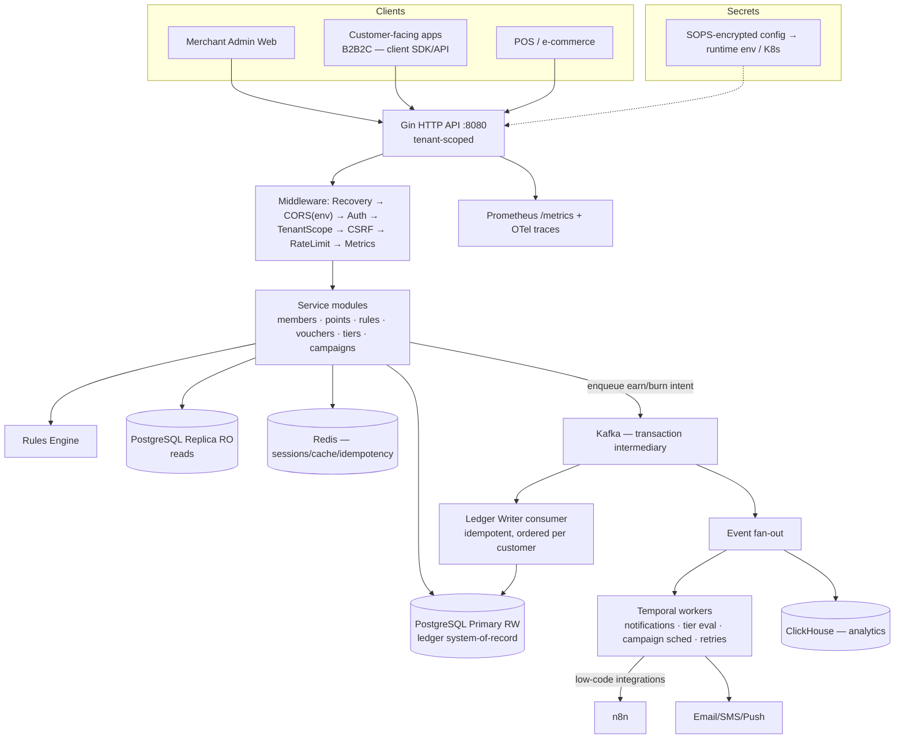

# Technical Requirements Document
## Loyalty Platform — go-loyalty-point

> Version: 2.1 (Draft)
> Author: Claude (Opus 4.8) — Principal Engineer / Solution Architect
> Date: 2026-06-24
> Status: Draft → Review → Approved
> Input documents: `code-analysis-20260623.md` · `product-analysis-20260623.md` · `loyalty-platform-market-research.md`
> **v2.0 changes:** §3 Target Architecture re-evaluated against answered §9 decisions — 500 TPS MVP target, Kafka as transaction intermediary, Temporal vs n8n for workers, in-house voucher engine, ClickHouse analytics store, B2B2C dual-facing scope, SOPS secrets, Indonesia-first. New subsections §3.5–§3.9.
> **v2.1 changes:** §9.1 answered and folded in — **self-hosted** Temporal + ClickHouse, **K8s/Docker POC** portable to EKS/GKE without major refactor, **hybrid member-auth** (per-tenant local default + optional OIDC federation). New §3.10 (member identity & auth). Phases 1–2 and deployment §3.9 updated.

---

## 1. Executive Summary

go-loyalty-point is a multi-tenant loyalty-points HTTP API (Go 1.23 / Gin / PostgreSQL / Redis) with a clean layered architecture but a critical gap: its central differentiator — the configurable program-rules engine — is dead code, and points are computed with hardcoded constants. The system also ships two P0 security defects (DB credentials baked into the published Docker image; a public endpoint leaking bcrypt hashes) and silently swallows 5xx errors. The target state, delivered over **5 phases (Phase 0–4, ~26–34 weeks total)**, is a stabilized, observable, event-driven loyalty engine where rules actually drive point math, members and operators have working UIs for the full earn→redeem→engage loop, and the platform moves toward segmentation and predictive personalization. **The single most critical risk is data integrity in the points ledger** — any regression in earn/burn atomicity or idempotency during the rules-engine rewiring corrupts customer balances and the financial liability record.

---

## 2. Current State Assessment

### 2.1 System Snapshot
- **Architecture pattern:** Monolith, layered (Handler → Service → Repository) with domain-defined repository interfaces; partial hexagonal (boundary leaks where middleware/router depend on concrete `*postgres.AuthRepository`). Manual DI in `server/bootstrap/`.
- **Core tech stack:** Go 1.23, Gin v1.10, PostgreSQL 17 (primary + read replica), Redis (go-redis **v8, EOL**), lib/pq (raw SQL, no ORM), bcrypt + random-token auth (not JWT), zerolog, golang-migrate, swaggo. Kafka (kafka-go) imported but **unused**.
- **Codebase age / maturity:** ~6 months; early-stage. Backend far ahead of the thin, mostly-template web UI.
- **Team size indicators:** Single author (Dandi). Consistent style with minor drift (latency-decorator pattern only on `UserService`).

### 2.2 What Works (Keep)
- Typed domain errors (`server/domain/errors.go`) + clean HTTP mapper (`server/util/error_handler.go`).
- Repository interfaces in domain → services depend on interfaces; mock-based test suites.
- Parameterized queries throughout — no SQL injection observed.
- **Atomic points ledger insert** — CTE-based balance compute+insert in `points_repository.go` avoids read-then-write races.
- Read/write DB separation (primary RW + replica RR) wired correctly.
- CSRF double-submit cookie; Redis session caching with DB fallback.
- Structured zerolog logging; `/ping` health check across PG primary/replica/Redis.
- Solid testify/suite templates (`points_service_test.go`, `auth_service_test.go`).

### 2.3 What's Broken or At Risk (Fix)

| Severity | Issue | Location | Impact |
|---|---|---|---|
| 🔴 Critical | `.env` (DB/Redis creds) baked into published Docker image (C1) | `Dockerfile:37`; pushed via `docker-publish.yml` | Credential disclosure to anyone pulling the image |
| 🔴 Critical | Public endpoint returns bcrypt password hashes (C2) | `internal_load_test_handler.go` `GetRandomVerifiedUser`, route `/api/auth/test/random-user` | Unauthenticated hash harvest for offline cracking |
| 🔴 Critical | `LogError` is an unimplemented stub (C3) | `server/util/error_handler.go:116` | All 5xx errors silently swallowed; zero prod visibility |
| 🔴 Critical | All Redis sessions wiped on every startup (C4) | `cmd/api/main.go:76` `DeleteAllSession` | Every deploy/restart force-logs-out all users; rolling deploys wipe live sessions |
| 🟡 Significant | Rules engine is dead code; hardcoded point math (S1) | `point_rewards_engine.go` (never called); `transaction_service.go` | Core feature is a façade — configured rules do nothing |
| 🟡 Significant | `UserService` interface ≠ implementation (no ctx) (S2) | `domain/interfaces.go` vs `service/user_service.go` | Concrete type bypasses abstraction |
| 🟡 Significant | Latency decorator swallows typed errors (S3) | `user_service.go` + `util.ServiceLatencyDecorator` | Callers lose not-found/conflict/system distinction |
| 🟡 Significant | No graceful shutdown (S5) | `cmd/api/main.go:91` `r.Run` | SIGTERM hard-kills in-flight requests |
| 🟡 Significant | CORS locked to `localhost:8080` (S6) | `bootstrap/router.go` | Blocks any real frontend origin |
| 🟡 Significant | Redemption + transaction money paths untested (S8) | `redemption_service_test.go`, `transaction_service_test.go` (1-line stubs) | Highest-blast-radius code has zero coverage |
| 🟡 Significant | CI runs `go test` **without `-race`** | `.github/workflows/go.yml` | Data races invisible |
| 🟢 Minor | Orphaned `server/router/router.go` stub (S4); `DLE`→`IDLE` config typo (S9); misleading `go-playground` module name; `user_id` cookie not httpOnly; CSRF token values logged on mismatch; go-redis v8 EOL | various | Maintainability / minor security hardening |

### 2.4 Feature Gap Summary (product analysis vs. market research)

| Gap Category | Current State | Market Standard | Priority |
|---|---|---|---|
| Points engine | Hardcoded formulas; rules ignored | Runtime-configurable rules drive all earn/burn | 🔴 High |
| Redemption UX | Server-only, no UI | Member discovery → select → confirm → instant payoff | 🔴 High |
| Tier management | Not present | ≥3 configurable tiers, downgrade rules, benefits | 🟡 Medium |
| Voucher system | Not present | Bulk gen, stacking rules, contextual eligibility | 🟡 Medium |
| Gamification | Not present | Challenges, streaks, progress, badges | 🟢 Low |
| Personalization / AI | None | Segments, behavioral triggers, churn prediction | 🟢 Low |
| Analytics | Fake template dashboard | Earn/burn ratio, lifecycle, cohort, real-time, BI export | 🔴 High |
| Mobile experience | None | Persistent balance, push, wallet, offline earn | 🟢 Low |
| Admin / merchant console | Stores + read-only views; core actions server-only | No-code rule builder, campaign wizard, fraud dashboard | 🔴 High |

> **Conflict flagged (do not silently resolve):** the product analysis lists many features as "Active," while the code analysis shows the money paths (`RedemptionService.Create`, `TransactionService.Create`) have **zero tests** and the rules engine is disconnected. Resolution: treat "Active" in the product doc as "endpoint reachable," **not** "verified correct." Phase 0 must add tests before any feature is trusted as stable.

---

## 3. Target Architecture

> **v2 re-evaluation.** §9 answers change the architecture materially: Kafka is now a **transaction intermediary** (not just an event fan-out), Temporal is a candidate for durable workers, ClickHouse is the analytics store, and the product is **B2B2C** (a B2B platform that also powers our clients' customer-facing experiences). The 500 TPS MVP target keeps the design firmly in modular-monolith territory — no microservices needed.

### 3.1 Architecture Decision

- [x] **Modular monolith + durable async edge (Kafka + Temporal), refactor in place** ✅ **CHOSEN (v2)**
- [ ] Refactor in place only (v1 position — superseded; async edge now explicit)
- [ ] Selective extraction now
- [ ] Full microservices migration
- [ ] Replace with composable platform

**Justification.** 500 TPS is modest — a single well-tuned Go service against PostgreSQL handles it with headroom; microservices would add operational cost and distributed-transaction complexity for no benefit at this scale and team size (one developer). The codebase already has the right bones (layered, domain interfaces, atomic ledger). So the core stays a **modular monolith**, but v2 makes the **async edge explicit**: a Kafka write-path in front of the ledger for availability/burst absorption, and a durable workflow engine (Temporal) for retried/scheduled side effects. The loyalty/voucher engine is **built in-house** (per §9) — no third-party engine. Module boundaries inside the monolith (members, points-ledger, rules, vouchers, tiers, campaigns, analytics-export) are drawn now so that any future extraction is a lift, not a rewrite.

### 3.2 Target System Diagram

### 3.3 Core Design Principles
1. **Single source of truth for balances** — PostgreSQL ledger is authoritative; Kafka and ClickHouse are derived/buffering layers, never the balance authority.
2. **Idempotent transactions** — every earn/burn keyed by a client-supplied transaction ID; replay never double-credits (Redis idempotency key + unique DB constraint + the existing atomic CTE insert).
3. **Rules drive math** — no hardcoded point constants; `TransactionService` MUST consult active `ProgramRule`s for every calculation.
4. **Durable async for side effects** — notifications, tier evaluation, campaign scheduling, and analytics run off the event stream via Temporal/consumers, not inline.
5. **Tenant isolation first** — every query, cache key, and event is scoped by tenant (merchant/client); a B2B2C surface cannot leak one client's members to another.
6. **API-first, dual audience** — every capability exposed and tested via API before any UI; the same core API serves the merchant admin and (tenant-scoped) the clients' customer-facing apps.
7. **Observable by default** — logs + metrics + traces; no feature is "Done" without an SLO dashboard.
8. **Secrets only at runtime** — SOPS-encrypted, decrypted into env at deploy; never in images or committed plaintext.

### 3.4 Tech Stack Decisions

| Layer | Current | Recommended | Change Type | Rationale |
|---|---|---|---|---|
| Language | Go 1.23 | Go 1.23+ | Keep | Sound; team fluent |
| Framework | Gin v1.10 | Gin v1.10 | Keep | Adequate at 500 TPS |
| Primary DB (system-of-record) | PostgreSQL 17 (RW+RR) | Same | Keep | Authoritative ledger; replica for reads |
| Cache / session / idempotency | go-redis **v8 (EOL)** | go-redis v9 | Upgrade | EOL; also hosts idempotency keys + rate-limit counters |
| Transaction intermediary / event bus | kafka-go (unused) | kafka-go, **wired** | Activate | Burst absorption + HA write-path + event fan-out (§3.5) |
| Workflow / worker orchestration | None (n8n referenced) | **Temporal** primary; n8n for low-code integrations | Add | Durable retries, scheduled tier eval/campaigns (§3.6) |
| Analytics store | None | **ClickHouse** | Add | Columnar OLAP for earn/burn, cohort, real-time dashboards (§3.8) |
| Secrets management | `.env` in image (C1) | **SOPS** → runtime env / K8s Secrets | Replace | Encrypted-at-rest config; removes C1 |
| Search | None | None (defer) | Keep | No need |
| Auth | bcrypt + random token | Keep; add MFA for admin; tenant claims | Improve | Token model fine; add tenant scoping + admin MFA |
| Infra / deploy | Docker + K8s manifest | Same + SOPS; Indonesia region first | Improve | §3.9 |
| Observability | **None** | Prometheus + OTel | Add | Largest operational gap |
| Mobile | None | Deferred (B2B2C SDK later) | — | Customer apps are clients'; we expose API/SDK |

### 3.5 Transaction Ingestion & Consistency Model (Kafka as intermediary)

§9 intent: *"Kafka for async, message bus, intermediary to serve critical transactions before/after DB for HA and speed."* This is sound **if** the consistency boundary is explicit — a naive "write to Kafka, ack the client, write DB later" (write-behind) would make balances eventually-consistent and risks lost updates. Recommended model:

- **Synchronous authority, async amplification (default earn/burn path).** The API validates, applies the rule engine, and commits the ledger entry to PostgreSQL **synchronously** (the CTE insert already does this atomically), then publishes a `points.committed` event to Kafka for fan-out (notifications, ClickHouse, tier eval). Client gets a strongly-consistent balance immediately. At 500 TPS this is comfortably within the <300ms p99 budget.
- **Kafka write-buffer (opt-in, high-burst ingestion).** For bulk/offline POS or campaign spikes that exceed sync capacity, accept an earn *intent* onto Kafka, return `202 Accepted` with a transaction ID, and have the **Ledger Writer consumer** apply it idempotently, **partitioned by customer ID** so per-customer ordering is preserved. Balance for that path is eventually-consistent (seconds); the member dashboard shows "pending."
- **Idempotency everywhere.** Client transaction ID → Redis key (fast dedupe) + unique DB constraint (authoritative dedupe). Same ID on either path is a no-op.
- **Failure handling.** If Kafka is down, the **sync path still works** (Kafka is fan-out, not a hard dependency) — degrade by writing the event to the existing PostgreSQL `event_log` and replaying later. The buffer path returns 503 if Kafka is unavailable.

> **Decision:** default to the **synchronous-authority** path for MVP correctness; ship the Kafka write-buffer as an explicit, opt-in ingestion mode for bulk/high-burst tenants. Do **not** make routine single-transaction balances eventually-consistent.

### 3.6 Workflow Orchestration — Temporal vs n8n

§9 asks to compare n8n with Temporal for the "worker."

| Dimension | Temporal | n8n |
|---|---|---|
| Model | Code-defined durable workflows (Go SDK) | Visual, low-code node graphs |
| Durability / retries | First-class: automatic retries, timers, state survives restarts | Basic retry; not built for long-lived stateful workflows |
| Best for | Tier re-evaluation, points expiry sweeps, campaign scheduling, multi-step redemption sagas, guaranteed notification delivery | Connecting to 3rd-party SaaS (email vendor, CRM, Slack), ops glue, quick integrations |
| Operational cost | Heavier (server + DB), but matches our reliability needs | Light, but weak for financial-grade guarantees |

> **Decision:** **Temporal as the primary worker/orchestrator** for anything touching points, tiers, expiry, or guaranteed delivery — it gives durable, idempotent, retryable execution that a loyalty ledger demands. **Self-hosted** (§9.1) — Temporal server + its own PostgreSQL/Cassandra persistence, deployed in-cluster (§3.9); no Temporal Cloud dependency or per-action billing. **Keep n8n** as the low-code integration layer for non-critical external glue (e.g., marketing email vendor, CRM sync), invoked *from* Temporal activities. The current n8n reference (commit `f12954c`) is repurposed to this integration role, not the critical path.

### 3.7 Multi-Tenancy & B2B2C Surface

Product is B2B2C (§9: *"we serve B2B, but able to enhance/improve our B2B clients' products"*) — so the platform must serve both the **merchant admin** and, tenant-scoped, the **clients' own customers**.

- **Tenant model.** Existing hierarchy (User/business → Merchant → Program → Customer) is the tenant tree. Add a `tenant_id` (business/client) propagated through auth claims, every repository query, every cache key, and every Kafka event key.
- **Two API audiences, one core.** A `/v1/admin/*` surface (merchant operators) and a `/v1/member/*` surface (the client's end customers — balance, rewards, redeem). Both enforce `TenantScope` middleware; member tokens are scoped to a single customer within a single tenant.
- **Isolation tests are mandatory** (added to §6.5): a member of tenant A must never read tenant B data — assert in integration tests.
- **Member identity & auth.** Hybrid model (§9.1) — see §3.10.
- **Delivery to clients.** Expose the member API + a thin JS/mobile SDK so B2B clients embed balance/redeem into their own apps. Native mobile SDK deferred; API + web widget first.

### 3.8 Analytics Data Path (ClickHouse)

- **Self-hosted** ClickHouse (§9.1), deployed in-cluster (§3.9) — no managed-service dependency or per-query billing.
- Kafka `points.*`, `redemption.*`, `tier.*`, `campaign.*` events stream into ClickHouse via a consumer (or Kafka engine table).
- ClickHouse powers Phase 3 dashboards (earn/burn ratio, DAU/MAU, cohort, real-time campaign performance) and ad-hoc BI — PostgreSQL stays the transactional system-of-record; ClickHouse is read-only derived analytics.
- Export/BI to client warehouses (Phase 3 FR-3.4) reads from ClickHouse, not from the transactional DB (protects ledger performance).
- **Retention (proposed — §9.1 left open):** raw event rows kept hot 90 days, then rolled into monthly aggregates via ClickHouse TTL + materialized views; raw retained 13 months for YoY cohort, then dropped. Tune per storage budget.

### 3.9 Deployment & Region

- **Portable Kubernetes from day one (§9.1).** POC runs on plain **K8s + Docker** (local kind/minikube or a single node); the manifests + container images are cloud-agnostic so promotion to **EKS or GKE** is a config/ingress/storage-class change, **no major refactor**. Avoid cloud-proprietary primitives in app code; keep dependencies (PostgreSQL, Redis, Kafka, Temporal, ClickHouse) as in-cluster deployments or swappable managed equivalents behind config.
- **Self-hosted dependencies in-cluster** for POC: Temporal (§3.6) and ClickHouse (§3.8) run as cluster workloads; can later move to managed offerings without app changes.
- **Indonesia-first** (§9: SEA, Indonesia MVP). Single primary region in Indonesia (e.g. GKE Jakarta `asia-southeast2` / AWS `ap-southeast-3`) for residency and latency; design for later SEA multi-region but do not build it now.
- SOPS-encrypted config per environment; secrets decrypted at deploy into K8s Secrets / runtime env.
- **Regulatory stance (§9):** *develop first, defer regulation.* Accepted as a deliberate MVP trade-off — but the ledger is built as a proper double-entry audit trail anyway (cheap to do now, expensive to retrofit), so points-liability compliance is a *reporting* add-on later, not a re-architecture.

### 3.10 Member Identity & Auth (B2B2C — Hybrid)

§9.1 decision: **hybrid**. One internal member model; authentication source is configurable **per tenant** so small clients onboard with zero integration while enterprise clients keep their own SSO.

- **Default — per-tenant local identity (`auth_source = local`).** The platform stores member credentials (or passwordless/OTP), scoped to `tenant_id`. Same email can exist independently across tenants. We issue the tenant-scoped member token. Zero integration → fits Indonesia-first SMB clients.
- **Optional — federated to client IdP (`auth_source = federated`).** Larger clients integrate via **OIDC** (preferred) or SAML: the member logs into the *client's* app, the client passes a signed assertion (`sub` + `tenant_id`), we verify against the tenant's registered IdP/JWKS and map to our member record. We store **no** credentials on this path.
- **One token model downstream.** Both paths resolve to the same tenant-scoped member access token the `/v1/member/*` API already expects; services and the ledger never branch on auth source.
- **Per-tenant config.** `tenant.auth_source` + (for federated) issuer URL, JWKS endpoint, client ID, claim mapping. Validated at tenant onboarding.
- **Phasing.** Ship **local** in Phase 2 (unblocks the member dashboard + B2B2C surface); add **OIDC federation** as a fast-follow within Phase 2/early Phase 3 when the first SSO-demanding client lands. SAML deferred until required.
- **Admin auth is unchanged** — merchant operators keep the existing token model + MFA (§6.1); only the member surface is hybrid.

---

## 4. Feature Decisions

✅ Keep · 🔧 Improve · ➕ Add · ❌ Deprecate

### 4.1 Points & Currency
| Feature | Disposition | Notes / Requirements |
|---|---|---|
| Basic earn on purchase | 🔧 Improve | Works but uses hardcoded constants; must route through rules engine |
| Multi-currency points | ➕ Add | Not present; defer to post-Phase 2 unless required |
| Points expiry | ➕ Add | No expiry logic today; add configurable expiry (Phase 2) |
| Points ledger / audit trail | ✅ Keep | Atomic CTE insert is sound; extend with idempotency key |
| Partner earning | ➕ Add | Not in scope until coalition need confirmed |
| Retroactive earning | ➕ Add | Defer |

### 4.2 Redemption
| Feature | Disposition | Notes / Requirements |
|---|---|---|
| Discount redemption | 🔧 Improve | Server logic exists, untested (S8), no UI |
| Free product redemption | 🔧 Improve | `RedemptionService.Create` exists; add tests + UI |
| Voucher redemption | ➕ Add | No voucher system today |
| Pay-with-points (partial) | ➕ Add | Phase 2 |
| Cashback redemption | ➕ Add | Defer |
| Charity / donation | ➕ Add | Defer |

### 4.3 Tiers & Status
| Feature | Disposition | Notes / Requirements |
|---|---|---|
| Threshold-based tiers | ➕ Add | Phase 2; ≥3 configurable tiers |
| Tier benefits engine | ➕ Add | Phase 2 |
| Tier downgrade rules | ➕ Add | Phase 2; configurable grace period |
| Tier challenge / accelerator | ➕ Add | Defer to Phase 4 (gamification) |

### 4.4 Vouchers & Promotions
| Feature | Disposition | Notes / Requirements |
|---|---|---|
| Voucher generation (bulk) | ➕ Add | Phase 2; ≥10k codes/batch |
| Stacking rules | ➕ Add | Phase 2 |
| Contextual eligibility | ➕ Add | Phase 2 (tier/segment/SKU/channel/date) |
| Referral vouchers | ➕ Add | Defer |
| Dynamic value vouchers | ➕ Add | Defer |

### 4.5 Gamification
| Feature | Disposition | Notes / Requirements |
|---|---|---|
| Challenges / missions | ➕ Add | Phase 2 MVP (trigger/target/reward/deadline) |
| Streaks | ➕ Add | Defer |
| Badges / achievements | ➕ Add | Defer |
| Progress indicators | ➕ Add | Phase 2 (member dashboard) |

### 4.6 Personalization & AI
| Feature | Disposition | Notes / Requirements |
|---|---|---|
| Segment-based offers | ➕ Add | Phase 4 |
| Behavioral triggers | ➕ Add | Phase 4 (event bus prerequisite) |
| Predictive churn offers | ➕ Add | Phase 4; gated on data volume |
| A/B testing on rewards | ➕ Add | Phase 4 |
| Next-best-offer engine | ➕ Add | Defer beyond Phase 4 |

### 4.7 Analytics & Reporting
| Feature | Disposition | Notes / Requirements |
|---|---|---|
| Member lifecycle report | ➕ Add | Phase 3 |
| Earn/burn ratio dashboard | ➕ Add | Phase 3 (financial liability metric) |
| Campaign performance | ➕ Add | Phase 3 |
| BI / data warehouse export | ➕ Add | Phase 3 |
| Real-time dashboards | ➕ Add | Phase 3 |
| Fake "Sales" template dashboard | ❌ Deprecate | Remove demo data; replace with real or honest empty state |

### 4.8 Admin / Merchant Console
| Feature | Disposition | Notes / Requirements |
|---|---|---|
| No-code rule builder | ➕ Add | Phase 3; rules already modeled in DB |
| Campaign creation wizard | ➕ Add | Phase 3 |
| Member/customer search & lookup | ➕ Add | Customer entity server-only today; needs UI |
| Fraud dashboard | ➕ Add | Phase 3 (velocity checks) |
| Voucher management | ➕ Add | Phase 3 |
| Read-only stores/programs/transactions UI | 🔧 Improve | Fix token-name auth bug; add create flows |
| Orphaned `server/router/router.go` | ❌ Deprecate | Delete (S4) |
| Public load-test endpoint | ❌ Deprecate | Remove/gate (C2) |

---

## 5. Phased Delivery Plan

### Phase Structure Rationale
**"Stabilize before adding, core loop before intelligence."** Phase 0 is non-negotiable: the P0 security defects and silent-error stub make the system unsafe to build on, and the money paths are untested. Phase 1 makes earn→redeem→notify provably correct (and wires the rules engine — the central broken feature). Phases 2–4 layer member experience, operator tooling, then intelligence. Each phase depends on the prior.

---

### Phase 0 — Stabilize & De-risk
**Goal:** Make the current system safe to build on.
**Duration:** ~2 weeks.
**Prerequisite for:** all subsequent phases.

#### Scope
- [ ] Fix all 🔴 Critical issues (C1–C4 from §2.3); replace `.env`-in-image with **SOPS**-managed secrets.
- [ ] Add `-race` to CI test run.
- [ ] Add integration-style tests for `RedemptionService.Create` and `TransactionService.Create` (target ≥80% coverage on these two services).
- [ ] Implement `LogError` (zerolog one-liner).
- [ ] Document all undocumented APIs in OpenAPI (regenerate Swagger, enforce in CI).
- [ ] Observability baseline: make zerolog level runtime-configurable; ensure 5xx are logged.

#### Definition of Done
- Zero known P0 security defects; credentials rotated for any creds shipped in a published image.
- Published Docker image contains no secrets (verified: `docker run --rm  cat /app/.env` fails).
- `/api/auth/test/random-user` removed or auth-gated with password field dropped.
- `go test -race ./...` green in CI.
- `RedemptionService.Create` + `TransactionService.Create` covered by automated tests.
- Restart no longer wipes active sessions (verified across a rolling restart).

#### Risks
| Risk | Likelihood | Impact | Mitigation |
|---|---|---|---|
| Credentials already leaked via published image | Medium | Critical | Rotate all creds in C1/C2; audit GHCR pull logs if available |
| Adding tests surfaces latent money-path bugs | Medium | High | Fix as found; treat as Phase 0 scope, not deferred |

---

### Phase 1 — Core Loop Integrity (incl. Rules Engine Wiring)
**Goal:** Earn → Redeem → Notify works reliably, in real time, with rules actually applied.
**Duration:** ~4–6 weeks.
**Depends on:** Phase 0 complete.

#### Functional Requirements

**FR-1.1 — Points Ledger**
- MUST record every earn and burn as an immutable entry with: customer+program ID, transaction ID, amount, timestamp, source (channel/event type), resulting balance.
- MUST be idempotent: re-submitting the same transaction ID MUST NOT create a duplicate entry (extend the existing CTE insert with a unique transaction-ID constraint).
- Balance MUST be consistent within 500ms of a transaction completing.

**FR-1.2 — Earning Engine (Rules Wiring — fixes S1)**
- `TransactionService.Create` MUST compute points by evaluating active `ProgramRule`s via the rewards engine — NOT hardcoded constants.
- Earn rules MUST be configurable at runtime (no deploy) — by amount, transaction type, count, tenure, merchant, category (the rule model already supports these).
- Shadow `Transaction`/`Program`/`ProgramRule` types in `point_rewards_engine.go` MUST be deleted; the engine MUST use domain types.
- Concurrent transactions for one customer MUST NOT produce balance inconsistency.

**FR-1.3 — Redemption Engine**
- MUST validate available balance before committing any redemption.
- A failed redemption MUST NOT deduct points; rollback MUST be atomic.
- Partial redemption (pay-with-points) MUST be supported (new capability).

**FR-1.4 — Real-Time Notifications (Event Bus Activation)**
- The system MUST emit a `points.committed` event to Kafka within 2 seconds of any earn or burn (sync-authority path of §3.5).
- Payload MUST include: tenant ID, points delta, new balance, transaction reference, trigger event type.
- A **Temporal** workflow MUST consume the event and deliver the notification with durable retry; external delivery (email vendor) MAY route through n8n as a Temporal activity (§3.6).
- Kafka MUST NOT be a hard dependency of the sync earn/burn commit — if the bus is unavailable, fall back to the PostgreSQL `event_log` and replay.

#### Non-Functional Requirements
| Requirement | Target |
|---|---|
| API response time (p99) | < 300ms |
| Transaction throughput | ≥ **500 TPS** (MVP target, §9); load-test headroom to 1,000 TPS |
| Points ledger uptime | 99.9% |
| Data consistency | Strong on the sync earn/burn path; eventual (seconds) only on the opt-in Kafka write-buffer path (§3.5) |

#### Technical Tasks
- [ ] Wire `ProgramRuleRepository.GetActiveRules` into `TransactionService.Create`; apply `calculatePoints`/`evaluateRule` — Effort: L — Owner: backend.
- [ ] Delete shadow types in `point_rewards_engine.go` — Effort: S — Owner: backend.
- [ ] Add unique constraint + Redis idempotency check on transaction ID in ledger insert — Effort: M — Owner: backend.
- [ ] Implement partial redemption in `RedemptionService` — Effort: M — Owner: backend.
- [ ] Wire Kafka producer (`points.committed`) on earn/burn + Temporal notification workflow; PostgreSQL `event_log` fallback when bus down — Effort: L — Owner: backend.
- [ ] Stand up **self-hosted** Temporal (server + persistence + Go SDK worker) as in-cluster K8s workload — Effort: M — Owner: backend.
- [ ] Load test at 1,000 TPS (2× MVP target) — Effort: M — Owner: backend.

#### Definition of Done
- All FR-1.x pass automated integration tests.
- Configured rules demonstrably change point math (regression test: same transaction, different rule → different points).
- Load test at 1,000 TPS (2× MVP target) passes with no errors and p99 < 300ms.
- Earn/burn visible downstream within 2 seconds via the event bus; Temporal notification delivered with retry.

#### Risks
| Risk | Likelihood | Impact | Mitigation |
|---|---|---|---|
| Rules wiring regresses ledger correctness | Medium | Critical | Idempotency tests + ledger-reconciliation test before merge |
| Kafka activation adds operational instability | Medium | Medium | Kafka is fan-out only on sync path; `event_log` fallback on bus failure (§3.5) |
| Temporal adds infra/learning overhead for solo dev | Medium | Medium | Start with one workflow (notifications); expand only as needed |

---

### Phase 2 — Member Experience
**Goal:** Member-facing product competitive with market standard — tiers, vouchers, gamification MVP, real member dashboard.
**Duration:** ~6 weeks.
**Depends on:** Phase 1 complete.

#### Functional Requirements

**FR-2.1 — Tier System**
- MUST support ≥3 configurable tier levels, each with independent qualifying rules.
- Tier evaluation MUST run on every qualifying transaction and on a configurable interval.
- Downgrade grace periods MUST be configurable per tier.
- Members MUST be notified on tier upgrade/downgrade (via event bus).

**FR-2.2 — Voucher Engine**
- MUST support bulk generation of unique single-use codes (≥10,000 per batch).
- Eligibility MUST be configurable by tier, segment, SKU, channel, date range.
- Stacking rules MUST be enforceable per transaction.
- Every redemption MUST be logged with voucher code, customer ID, transaction value, timestamp.

**FR-2.3 — Member Dashboard (closes core "no UI" gap)**
- MUST show: current balance, pending points, expiring points (with date), tier status + progress, active vouchers, recent transaction history (≥90 days).
- State MUST reflect completed transactions within 5 seconds.
- MUST replace the fake "Sales" template dashboard (deprecation from §4.7).

**FR-2.4 — Gamification (MVP)**
- MUST support challenge definition: trigger event, target count/value, reward, deadline.
- Active-challenge progress MUST be visible in the dashboard.
- Challenge completion MUST auto-trigger the reward and notify the member.

#### Technical Tasks
- [ ] Tier model + evaluation service + migrations — Effort: L — Owner: backend.
- [ ] Voucher engine **built in-house** (generation, eligibility, stacking, redemption log) — Effort: L — Owner: backend. *(Decision §9: build, not Voucherify.)*
- [ ] Member dashboard UI + fix token-name auth bug (`session_token` vs `auth_token`) — Effort: L — Owner: frontend.
- [ ] Hybrid member-auth: per-tenant **local** identity + `auth_source` config (§3.10); OIDC federation as fast-follow — Effort: L — Owner: backend.
- [ ] Points expiry logic + expiring-soon surface — Effort: M — Owner: backend.
- [ ] Challenge MVP service + dashboard cards — Effort: M — Owner: full-stack.

#### Definition of Done
- All FR-2.x pass integration tests.
- Member dashboard renders correctly on mobile web (no native app this phase).
- Voucher bulk generation completes 10,000 codes in < 60 seconds.
- No screen displays template/demo data.

---

### Phase 3 — Merchant & Operations
**Goal:** Operators run campaigns, detect fraud, and export data without engineering support.
**Duration:** ~6–8 weeks.
**Depends on:** Phase 2 complete.

#### Functional Requirements

**FR-3.1 — No-Code Rule Builder**
- Marketers MUST create/edit/activate/deactivate earn/burn rules without a deploy (rule model already exists in DB).
- MUST support condition groups (AND/OR), event-type triggers, segment targeting, time-bound activation, reward-type selection.
- Rule changes MUST be version-controlled: logged with author, timestamp, diff.

**FR-3.2 — Campaign Management**
- Campaigns MUST support scheduling (start/end, timezone), audience targeting (segment or tier), reward assignment.
- Results MUST be visible within 24 hours of launch.

**FR-3.3 — Fraud Controls**
- MUST apply configurable velocity checks: max earn per member per day/hour, max redemptions per voucher code, max referrals per member.
- Suspicious activity MUST raise an admin alert within 60 seconds.
- Operators MUST be able to freeze an account and reverse transactions without engineering.

**FR-3.4 — Analytics & Data Export**
- Pre-built reports MUST include: active members (DAU/MAU), earn rate, redemption rate, liability balance, top rewards, churn by cohort.
- Member-level event data MUST export as CSV or stream to a warehouse on a configurable schedule.

#### Technical Tasks
- [ ] Rule-builder admin UI over existing `ProgramRule` API + change-log table — Effort: L — Owner: full-stack.
- [ ] Campaign model + scheduler — Effort: L — Owner: backend.
- [ ] Velocity-check middleware + admin alerting + account freeze/reversal — Effort: L — Owner: backend.
- [ ] **ClickHouse** analytics store + Kafka→ClickHouse consumer + read models — Effort: L — Owner: backend.
- [ ] Export/BI pipeline reading from ClickHouse (not transactional DB) — Effort: M — Owner: backend.
- [ ] Customer management UI (entity is server-only today) — Effort: M — Owner: frontend.

#### Definition of Done
- A non-technical marketer creates and launches a campaign end-to-end without engineering (UAT-validated).
- Dashboards served from **ClickHouse** (§3.8); export to client warehouse runs on schedule.

---

### Phase 4 — Intelligence & Personalization
**Goal:** Move from rule-based to intent-driven.
**Duration:** ~6–8 weeks.
**Depends on:** Phase 3 complete + minimum member-data-volume threshold met (proposed below).

#### Functional Requirements

**FR-4.1 — Behavioral Triggers**
- MUST support real-time event-driven rules firing within 5 seconds of a qualifying action.
- Trigger events MUST be extensible via API (not limited to purchases).

**FR-4.2 — Segmentation Engine**
- Marketers MUST define dynamic segments by RFM score, tier, product affinity, behavioral history.
- Membership MUST recalculate at least daily; real-time recalculation MUST be available for high-value segments.

**FR-4.3 — Churn Prediction (MVP)**
- MUST identify at-risk members from configurable activity signals.
- At-risk members MUST be surfaceable as a targetable segment.
- Automated retention offers MUST be triggerable for them without manual intervention.

**FR-4.4 — A/B Testing**
- Marketers MUST run A/B tests on reward value, type, and earn rate for defined audience splits.
- Results MUST report automatically at test end with statistical significance indicated.

#### Data Requirements (proposed — §9 deferred to "best approach")
- **Minimum data volume before churn/segmentation is reliable:** ≥ 6 months of transaction history **and** ≥ 10,000 active members (earned ≥ once) **and** ≥ 100,000 logged transactions per tenant. Below this, ship rule-based segments only; hold ML churn until the threshold is met (avoids the thin-data failure in Risk §8).
- **Churn label window:** define churn as "no qualifying activity in N days" where N = 2–3× the median inter-purchase interval per tenant (computed, not fixed).
- All ML training data MUST be anonymized or pseudonymized.

#### Technical Tasks
- [ ] Behavioral-trigger engine on event bus — Effort: L — Owner: backend.
- [ ] Segmentation engine (RFM + behavioral) — Effort: L — Owner: backend/data.
- [ ] Churn model + at-risk segment surface — Effort: L — Owner: data science.
- [ ] A/B test framework + significance reporting — Effort: M — Owner: backend.

#### Definition of Done
- Churn model achieves ≥ **0.70 precision at ≥ 0.50 recall** on a held-out validation set (proposed starting bar — retention spend wasted on false positives must stay bounded; tune per tenant once live). Baseline to beat: a simple recency-based heuristic.
- A/B framework produces statistically significant results at 95% confidence.

---

## 6. Cross-Cutting Requirements

### 6.1 Security
- All API endpoints MUST require authentication; tokens MUST carry tenant + role scope; `TenantScope` middleware MUST enforce isolation on every request (§3.7).
- PII in transit MUST use TLS 1.2+; at rest AES-256 minimum.
- Admin console MUST enforce MFA.
- `govulncheck` (or equivalent) MUST run on every build, blocking High/Critical.
- `user_id` cookie MUST be httpOnly (fixes MEDIUM finding); stop logging CSRF token values.
- **Secrets MUST be managed via SOPS** (encrypted at rest in the repo, decrypted into runtime env / K8s Secrets at deploy) — no plaintext secrets in images or committed files (enforced from Phase 0; replaces C1).

### 6.2 Observability
- Every service MUST emit structured JSON logs with trace ID, customer ID, event type, duration, outcome.
- Prometheus metrics (request count, latency histogram, error rate) from Phase 1.
- Distributed tracing (OpenTelemetry) across boundaries from Phase 1 onward.
- SLO dashboards MUST be live before any phase is marked Done.
- Liveness/readiness split (`/healthz/live`, `/healthz/ready`) for K8s.

### 6.3 Data & Privacy
- Members MUST be able to request full data export and account deletion within 30 days.
- Points liability MUST be tracked as a financial ledger with full audit trail (extend existing ledger). **Note (§9):** active regulatory compliance is *deferred* for MVP, but the double-entry audit trail is built now so compliance reporting is a later add-on, not a re-architecture.
- **Data residency: Indonesia-first** (single region), designed for later SEA multi-region (§3.9).

### 6.4 API Standards
- Public APIs MUST follow REST conventions with versioning (`/v1/`, `/v2/`).
- No breaking changes within a version; deprecation notice ≥90 days.
- All endpoints documented in OpenAPI 3.x, enforced via CI check.

### 6.5 Testing Standards
| Test Type | Requirement |
|---|---|
| Unit | ≥80% coverage on business-logic layer |
| Integration | All API endpoints; run on every PR |
| Contract | All service-to-service / event-bus interfaces |
| Tenant isolation | Member of tenant A MUST NOT read tenant B data — asserted in integration tests (§3.7) |
| Load | Before every phase release; target 1,000 TPS (2× MVP) |
| Security scan | Every build; block on High/Critical |
| Race detection | `go test -race` in CI (from Phase 0) |

---

## 7. Deprecation Plan

| Item | Current Usage | Removal Phase | Migration Path | Owner |
|---|---|---|---|---|
| `.env` in Docker image | Built into every published image | Phase 0 | SOPS-encrypted config → runtime env / K8s Secrets | backend |
| `/api/auth/test/random-user` | Public test endpoint leaking hashes | Phase 0 | Remove, or internal-gate + drop password field | backend |
| `DeleteAllSession` at startup | Runs on every boot | Phase 0 | Remove; rely on Redis TTL | backend |
| Hardcoded point constants | `transaction_service.go` | Phase 1 | Replaced by rules engine | backend |
| Shadow types in `point_rewards_engine.go` | Local dup types | Phase 1 | Use domain types | backend |
| `server/router/router.go` | Orphaned stub | Phase 1 | Delete; routing in `bootstrap/router.go` | backend |
| Fake "Sales" template dashboard | Post-login landing | Phase 2 | Real member dashboard | frontend |
| Billing/Profile placeholders | Template sample content | Phase 2–3 | Real or remove | frontend |
| go-redis v8 | Sessions/cache | Phase 3 | Upgrade to v9 (context API change) | backend |

---

## 8. Risks Register

| Risk | Phase | Likelihood | Impact | Mitigation |
|---|---|---|---|---|
| Points-ledger corruption during rules rewiring | 0–1 | Medium | Critical | Idempotency + reconciliation tests; dry-run on staging; rollback plan |
| Leaked credentials already exploited (C1/C2) | 0 | Medium | Critical | Rotate immediately; audit registry/access logs |
| Rule-engine performance at scale | 1–2 | Medium | High | Load test at 2× peak before launch |
| Kafka activation destabilizes prod | 1 | Medium | Medium | Kafka fan-out only on sync path; `event_log` fallback (§3.5) |
| Write-buffer path causes balance drift / out-of-order | 1 | Low | High | Partition Kafka by customer ID; idempotency keys; mark balances "pending" (§3.5) |
| AI underperforms on thin data | 4 | High | Medium | Gate Phase 4 on min data-volume threshold (Phase 4 Data Requirements) |
| Deferred regulation creates later liability | All | Medium | Medium | §9 accepted trade-off; double-entry audit trail built now (§3.9) |
| Single-developer bus factor | All | High | High | Document runbooks/ADRs; keep changes small and reviewed |

---

## 9. Resolved Decisions (was Open Questions)

All v1 open questions answered by the operator. Decisions are now reflected in §3 and the phases.

| Question | Decision | Where Applied |
|---|---|---|
| Peak transaction volume? | **500 TPS** MVP target; load-test to 1,000 TPS | NFR §Phase 1, §3.4 |
| `.env` creds reused in non-local envs? / secrets approach | **Adopt SOPS** secret manager; rotate any shipped creds | §3.4, §6.1, §7 |
| n8n purpose? Temporal comparison? | **Temporal** = primary durable worker; **n8n** = low-code integration glue invoked from Temporal | §3.6, Phase 1 FR-1.4 |
| Kafka for production? which events? | Yes — **transaction intermediary** + event fan-out for HA/burst; sync-authority default, opt-in write-buffer | §3.5, §3.2 |
| Buy vs build voucher engine? | **Build in-house** | §3.1, Phase 2 |
| Analytics warehouse? | **ClickHouse** | §3.8, Phase 3 |
| Data residency? | **Indonesia-first**, design for later SEA multi-region | §3.9, §6.3 |
| Phase 4 min data volume? | Proposed: ≥6mo history + ≥10k active members + ≥100k txns/tenant | Phase 4 Data Requirements |
| Churn precision target? | Proposed: ≥0.70 precision @ ≥0.50 recall, beat recency heuristic | Phase 4 DoD |
| Customer-facing or back-office only? | **Both — B2B2C**: B2B platform that powers clients' customer-facing experiences | §3.7 (multi-tenancy, dual API) |
| Points legal classification? | **Defer regulation for MVP** (develop first); build double-entry audit trail now to avoid retrofit | §3.9, §6.3 |

### 9.1 Resolved (v2.1)
| Question | Decision | Where Applied |
|---|---|---|
| Temporal: self-host vs Temporal Cloud? | **Self-hosted**, in-cluster | §3.6, §3.9, Phase 1 |
| Indonesia region / provider? | **K8s + Docker POC**, cloud-agnostic → promote to **EKS/GKE** later, no major refactor; Indonesia zone (e.g. GKE `asia-southeast2`) | §3.9 |
| B2B2C member-auth model? | **Hybrid** — per-tenant local default + optional OIDC federation, `auth_source` per tenant | §3.10 |
| ClickHouse managed vs self-host; retention? | **Self-hosted**, in-cluster; retention proposed 90d hot / 13mo raw / monthly aggregates (tune) | §3.8, §3.9 |

### 9.2 Remaining Open Questions
| Question | Blocks | Owner | Due |
|---|---|---|---|
| ClickHouse exact retention budget (confirm proposed 90d/13mo)? | Phase 3 storage sizing | Data/Infra | Before Phase 3 |
| First federated client + IdP protocol (OIDC assumed; any SAML need)? | Phase 2/3 §3.10 | Eng/Product | When first SSO client lands |
| Self-hosted Temporal persistence: PostgreSQL (reuse) vs Cassandra? | Phase 1 infra | Engineering | Before Phase 1 |

---

## 10. Glossary

| Term | Definition |
|---|---|
| Earn | Any action that credits points to a balance |
| Burn | Any action that debits points from a balance |
| Idempotent | A transaction producing the same result whether submitted once or many times |
| FR | Functional Requirement |
| TPS | Transactions per second |
| RFM | Recency, Frequency, Monetary — segmentation model |
| Disposition | Per-feature decision: Keep / Improve / Add / Deprecate |
| PointsLedger | Append-only earn/redeem record; balance = last entry per customer+program |
| ProgramRule | Configurable earn rule — currently NOT applied to point math (fixed in Phase 1) |
| RW / RR | Read-Write primary / Read-Replica connections |
| Event bus / intermediary | Kafka — fan-out for events + opt-in write-buffer for high-burst ingestion (§3.5) |
| Temporal | Durable workflow engine — retried/scheduled side effects (notifications, tier eval, expiry) |
| n8n | Low-code integration tool — external SaaS glue, invoked from Temporal activities |
| ClickHouse | Columnar OLAP store for analytics/dashboards; derived from the event stream |
| SOPS | Secrets OPerationS — encrypts config at rest, decrypts into runtime env at deploy |
| B2B2C | Business-to-business-to-consumer — we serve B2B clients and power their end-customer experiences |
| Tenant | A business/client and its isolated data subtree (Merchant → Program → Customer) |

---

*End of TRD*
